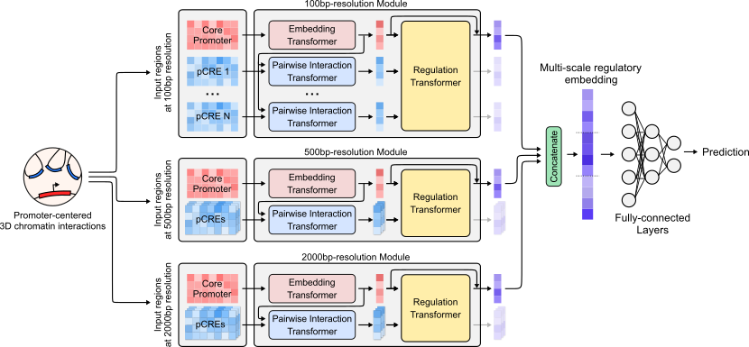
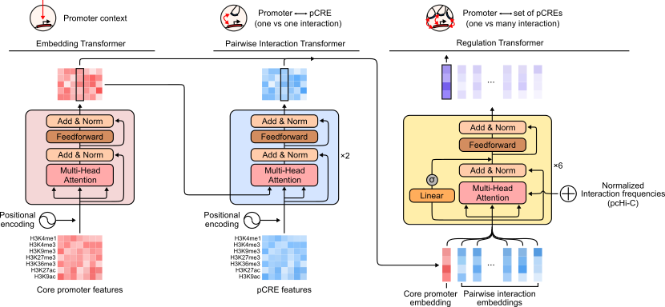

# Chromoformer


[](https://zenodo.org/badge/latestdoi/432363545)
[](https://badge.fury.io/py/chromoformer)

This repository provides the official code implementations for Chromoformer.

We also provide our pipelines for preprocessing input data and training Chromoformer model to help researchers reproduce the results and extend the study with their own data.
The repository includes two directories: `preprocessing` and `chromoformer`.

Refer to the directory named [`preprocessing`](preprocessing) to explore how we preprocessed the ChIP-seq signals and gene expression data for 11 cell lines from [Roadmap Epigenomics Project](http://www.roadmapepigenomics.org). We provide the whole preprocessing workflow from raw ChIP-seq reads to processed read depth signals for training as a one-shot `snakemake` pipeline. One can easily extend the pipeline for other cell types or other histone marks by slightly tweaking the parameters.

[`chromoformer`](chromoformer) directory provides the PyTorch implementation of the Chromoformer model.

## Model description

The full model architecture is shown below. It consists of three independent modules each of which accepts input features at different resolutions and in turn produces an embedding vector of the regulatory state at the core promoter. The resulting three regulatory embeddings are concatenated to form a multi-scale regulatory embedding which is subsequently fed into fully-connected layers to predict the expression level of a gene.



There are three transformer-based submodules: Embedding, Pairwise Interaction and Regulation transformer. To fully utilize the transformer architecture to model the complex dynamics of *cis*-regulations involving multiple layers, we conceptually decomposed the gene regulation into a three-layered hierarchy: (1) *cis*-regulation by core promoters, (2) 3D pairwise interaction between a core promoter and a putative *cis*-regulatory regions (pCREs) and (3) a collective regulatory effect imposed by the set of 3D pairwise interactions.



## Installation
You can install the `chromoformer` package using `pip`:
```bash
$ pip install chromoformer
```

To check whether Chromoformer works properly after installation, please refer the README file in [`demo`](demo) directory and follow the instructions.

## Training from scratch

You can train Chromoformer-clf (Chromoformer model for binary classification of gene expression) from scratch using the command below.

```bash
$ python -m chromoformer.train --config config.yaml --meta metadata.csv --npy-dir npy_dir \
    --fold 0 --binsizes 2000 500 100
```

Chromoformer-reg (Chromoformer model for regression of gene expression in log2-transformed RPKM) can be trained using the command below. (Note the `--regression` flag.)

```bash
$ python -m chromoformer.train --config config.yaml --meta metadata.csv --npy-dir npy_dir \
    --fold 0 --binsizes 2000 500 100 --regression
```


## Configuration file

The training configuration file is a `yaml` file that contains the following parameters as below (see `configs/default.yaml`):

```yaml
seed: 123
# biology
i_max: 8 # maximum number of interacting genomic regions to consider
w_prom: 40000 # window size around the core promoter
w_max: 40000 # maximum window size for regions (promoter and pCREs)
# optimization
num_epoch: 10
lr: 3e-5
bsz: 64
gamma: 0.87
# model
n_feats: 7
embed: # Embedding transformer
  n_layers: 1
  n_heads: 2
  d_model: 128
  d_ff: 128
pairwise_interaction: # Pairwise Interaction transformer
  n_layers: 2
  n_heads: 2
  d_model: 128
  d_ff: 256
regulation: # Regulation transformer
  n_layers: 6
  n_heads: 8
  d_model: 256
  d_ff: 256
d_head: 128 # inner dimension of the last fully-connected layer
```

## Metadata

Metadata file is a `csv` file that contains the following required columns as below (see `metadata.csv`):

| Column name | Description | Example |
|---|---|---|
|gene_id|Gene identifier|*ENSG00000116213*|
|label|Binary expression label. Means that the expression is higher than median (1) or not (0).|*1*|
|expression|Expression level of the corresponding gene (in RPKM)|*4.554*|
|chrom|Chromosome where the gene is placed.|*chr1*|
|start|Zero-based, inclusive coordinate of TSS|*3566667*|
|end|Zero-based, exclusive coordinate of TSS (trivially should be start+1)|*3566668*|
|strand|Direction of transcription. '+' for forward and '-' for reverse.|*+*|
|split|Group label for cross-validation. Note that we must use chromosomal split to avoid information leak during performance evaulation (i.e., no two genes in train/val set are on the same chromosome).|*0*|
|neighbors|A list of genomic regions interacting with the promoter. Should be joined by ';'|*chr1:14589068-14595292;chr1:13973835-13979555*|
|scores|Normalized interaction frequencies for each neghbor in `neighbors` columns. Should be joined by ';'|*1.5494*|

## Pretrained weights

[](https://doi.org/10.6084/m9.figshare.19424807.v4)

Pretrained weights for Chromoformer models (for Chromoformer-clf and Chromoformer-reg) are available at https://doi.org/10.6084/m9.figshare.19424807.v4.
Models were individually trained for 11 cell types from Roadmap Epigenomics Project. For each cell type, 18955 protein coding genes were divided into four non-overlapping cross-validation (CV) sets, and trained weights for each cross-validation fold is provided in this dataset.

The directory is organized firstly by Roadmap Epigenomics cell type (using corresponding EID), and four `pytorch` checkpoint files (a `.pt` file for each CV-fold) are placed in each directory.

`*.pt` files are basically dictionaries containing pretrained weights as well as some training details associated with the following keys:

- `net` : Pretrained weights. 
- `optimizer`: Status of pytorch optimizer at the time of model snapshot.
- `epoch`: Epoch at the time of model snapshot.
- `last_val_loss`: Validation loss at the time of model snapshot.
- `last_val_auc`: Validation AUC at the time of model snapshot.
- `val_score`: Output probabilities for genes in validation set.
- `val_label`: True labels for genes in validation set.

For example, you can load pretrained model weights for H1 human embryonic stem cells (E003) trained for fold 1 training set using the code below:

```python
import torch

ckpt = torch.load('E003/chromoformer-reproduction-E003-conf1-fold1.pt', map_location='cpu')
pretrained_model_weights = ckpt['net']
```

## System Requirements

### Hardware requirements

Chromoformer was trained using a server with 40 Intel(R) Xeon(R) Silver 4210R @ 2.40GHz CPUs, 128GB RAM and two GeForce RTX 3090 GPUs. The training procedure internally utilizes 8 cores (workers) and memory (RAM) footprint was <8GB throughout the training loop. GPU memory usage was ~10GB.

According to the statistics above, we provide the optimal hardware requirements as follows:

- **CPU requirement**: 8+ cores, 2.40+ GHz per core
- **GPU requirement**: 16+ GB GPU

### Software requirements

**Operating system**

Chromoformer training and evaluation were tested for *Linux* (Ubuntu 18.04) operating systems.

**Software package versions**

Chromoformer training and evaluation were tested for the following software packages and versions.

- **Python packages**
  - `python`=3.9.6
  - `pytorch`=1.9.0 (installed using cuda version 11.1)
  - `numpy`=1.21.0
  - `pandas`=1.3.0
  - `scikit-learn`=0.24.2
  - `tqdm`=4.61.2
  - `snakemake`=6.5.3
- **Commandline tools (required for training data preprocessing)**
  - `sambamba`=0.6.8
  - `bedtools`=2.23.0

## See also

We acknowledge the following deep learning model architectures since they were used as benchmark models for the evaluation of Chromoformer.
We highly recommend going through those works thoroughly to understand the concepts of deep learning-based gene expression prediction using histone modifications.

- `DeepChrome`: https://github.com/QData/DeepChrome
- `AttentiveChrome`: https://github.com/QData/AttentiveChrome
- `HM-CRNN`: https://github.com/pptnz/deeply-learning-regulatory-latent-space
- `GC-MERGE`: https://github.com/rsinghlab/GC-MERGE
- `DeepDiff`: https://github.com/QData/DeepDiffChrome

## Citation

Lee, D., Yang, J., & Kim, S. Learning the histone codes with large genomic windows and three-dimensional chromatin interactions using transformer. Nature Communications (2022)

```
@article{lee2022chromoformer,
  author={Lee, Dohoon and Yang, Jeewon and Kim, Sun},
  title={Learning the histone codes with large genomic windows and three-dimensional chromatin interactions using transformer},
  journal={Nature Communications},
  doi={10.1038/s41467-022-34152-5},
  year={2022},
  publisher={Nature Publishing Group}
}
```
