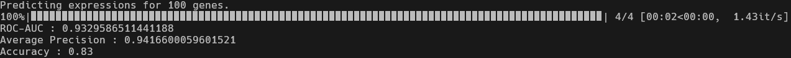
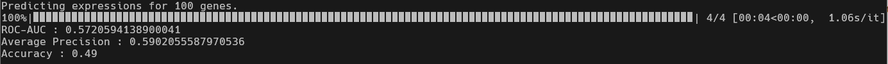

# Chromoformer demo

In this demo, we provide a minimal example illustrating how one can use pretrained Chromoformer to predict the expression of user-specified genes using the histone modification context at the promoter and three-dimensionally associated regions.

In particular, we let the model conduct out-of-fold prediction and see whether it performs reasonably well.
To simplify the process, we randomly subsampled 100 genes from validation set and specified their information in `demo_meta.csv` (i.e., genes that did not participate in the model training).

## Data preparation

To let Chromoformer predict gene expressions, we need to prepare the following three data. Note that in this demo directory, those data are already prepared so that one can easily test whether their environment for Chromoformer prediction is appropriately configured.

**1. Metadata**

We need a central `metadata` file harboring the genomic coordinate information for promoters, and associated putative *cis*-regulatory regions (pCREs) determined by independent experiments. Each row represents a single gene, and will serve as a unit of Chromoformer prediction.

The file should be formatted in csv (See `demo_meta.csv` in this directory) with some required columns. 
Mandatory fields for the `metadata` file are as follows:

- `gene_id`: Identifier of a gene (e.g., ENSG00000162819)
- `eid`: Roadmap Epigenomics cell type EID (e.g., E003)
- `label`: (Required only for training) The binary label denoting whether the gene is lowly- (0) or highly- (1) expressed.
- `chrom,start,end,strand`: Genomic position of the transcription start site of the gene. (e.g., chr1,222885893,222885894,+)
- `split`: (Required only for training) Fold split information used for 4-fold cross-validation.
- `neighbors`: A list of pCREs associated with the promoter of the gene. Separated by semicolons (;). (e.g., chr1:222949655-222956850;chr1:223444669-223448287)
- `scores`: A normalized interaction frequency scores for each of the pCREs. Orders should be kept the same as the column `neighbors`. (e.g., 1.849;1.5678)

**2. Pretrained weights**

You need a pretrained weights to obtain reasonable gene expression predictions.
In this directory, we provided a sample pretrained weight named `chromoformer-reproduction-E003-conf1-fold1.pt`.
This model was trained for the data from H1 embryonic stem cell (E003).
Also, note that this model is from one of the 4-fold cross validation (`-fold1.pt`).

Due to the large size of pretrained weights, we could not provide all pretrained weights in this repository. 
The full collection of Chromoformer model weights pretrained for 11 cell types is publicly available at [figshare](https://doi.org/10.6084/m9.figshare.19424807.v1).

**3. Region-wise histone modification levels**

According to the genomic coordinates of promoters and pCREs specified in `metadata`, the `data.py` module composes the histone modification levels into tensors that can be directly fed into Chromoformer model.
Indeed, we can let the `data.py` module parse the genomic tracks representing histone modification level (perhaps in `bedGraph` file) whenever needed, but this drastically slows down the whole training process.
Therefore, to speed-up the training/inference, we precompute the levels of histone modifications only for the genomic regions specified in the `metadata`.
In this demo, we provide a directory named `demo_data` that contains all the required region-wise histone modification levels in numpy array file format `.npy`.
To generate those region-wise histone modification levels formatted in `.npy` files from scratch on your own, please refer to the instruction in the [`preprocessing`](../preprocessing) directory.

## Run the prediction

Before running the prediction, please do not forget to activate `chromoformer` conda environment. If you did not prepare `chromoformer` conda environment, please refer [here](https://github.com/dohlee/chromoformer#installation). Also, make sure that the current directory is `demo`.

You can now run the gene expression prediction for the 100 genes simply by the script `run_demo.py`.
In the commandline (with the `chromoformer` environment enabled), run the following command, and it will finish shortly (~10s):

```shell
python run_demo.py \
    -i demo_meta.csv \
    -o demo_meta.predicted.csv \
    -w chromoformer-reproduction-E003-conf1-fold1.pt \
    -e E003
```

*Warning*: Please note that the provided demo script (`run_demo.py`) expects GPU-enabled environment, otherwise it may throw error. 

Parameters for `run_demo.py` are described as below:

- `-i, --input` : Path to input metadata CSV file.
- `-o, --output` :  Path to output metadata annotated with 'prediction column'.
- `-w, --weights` : Path to pretrained Chromoformer weights in .pt format
- `-e, --eid` : Specify cell type in Roadmap Epigenomics EID.


### Expected result

Running the demo script will produce an output file `demo_meta.predicted.csv`. 
The file will be exactly same as the original metadata file (`demo_meta.csv`), except for a new annotated column named `prediction`. For each gene, the value of `prediction` column represent the probability of being highly-expressed (or label=1).



## (For testing purpose only) Comparison with the prediction of untrained Chromoformer

One may be curious whether the results above truly implies that the model learned well.
This can be simply examined by comparing the performance with untrained/fresh model.

You can run the prediction using a newly-initialized (i.e., untrained) Chromoformer model and compare the results.

```shell
python run_demo.py \
    -i demo_meta.csv \
    -o demo_meta.predicted.csv \
    -e E003
```

### Expected result



As you can see, the untrained Chromoformer produces worse results compared to the trained one.