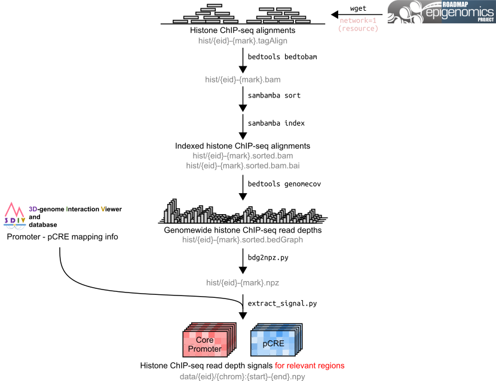

# Data preprocessing pipeline

We provide the whole data preprocessing pipeline used in this study as a single `snakemake` pipeline.

### Quickstart

Before running the preprocessing pipeline, you should install [conda](https://docs.conda.io/en/latest/) package manager and [snakemake](https://snakemake.readthedocs.io/en/stable/) workflow managing system. In short, the execution order of snakemake pipeline will be determined by the input-output dependencies specified in the snakemake rule files (Snakefile or `.smk` files in general), as in [GNU Make](https://www.gnu.org/software/make/manual/make.html). Here we eventually need processed histone ChIP-seq read depth files to train Chromoformer, so the whole preprocessing pipeline, properly configured with dependencies, will automatically do all the necessary jobs for you.

When you are ready with the prerequisites above, run the pipeline using the command below:

```
snakemake --resources network=1 -j 32 --restart-times 3 --use-conda --conda-frontend mamba -pr
```

Adjust the number of `network` resource according to your network bandwidth and I/O capacity (e.g., increasing it to 2 will allow at most two concurrent downloads). You can also adjust the number of processors to use with the parameter `-j`. To handle unexpected network issue when downloading data, adjust `--restart-times` option (3 will be sufficient in most cases). Note that `--use-conda` option will automatically install the required tools and python packages for you. We highly recommend to install `mamba`, which remarkably reduces the time to create environment compared to `conda`. If you do not have `mamba` installed in your system, install it in the base environment with:

```
conda install mamba -n base -c conda-forge
```

### Description

This pipeline downloads ChIP-seq data (in tagAlign files) from [Roadmap Epigenomics Web Portal](https://egg2.wustl.edu/roadmap/web_portal/) and process them into a bunch of numpy matrix files (in .npy) so that it can be readily used for the training procedure.

Only 11 out of 127 reference epigenomcs provided in the portal were selected for this study since they were sequenced for seven major histone marks (H3K4me1, H3K4me3, H3K9me3, H3K27me3, H3K36me3, H3K27ac, H3K9ac) of our interest. Indeed, it will be interesting to train Chromoformer with the whole set of histone marks including those seven and see if there is any performance boost, but we leave it for further study.

The whole procedure for preprocessing can be described as below:



1. Download histone ChIP-seq tagAlign files from Roadmap (`wget`)
2. Convert tagAlign files into BAM files, and sort/index them (`bedtools bedtobam`, `sambamba sort/index`)
3. Compute genomewide read depth using BAM files and save it as bedGraph files (`bedtools genomecov`)
4. Convert bedGraph in to npz files for easy file handling (`scripts/bdg2npz.py`)
5. Prepare train metadata table. Each row of the table corresponds to a gene annotated with 0/1 label (i.e., lowly/highly expressed), TSS position, putative *cis*-regulatory elements interacting with that gene (`scripts/prepare_train_metadata.py`). Of note, the information about the pairwise interactions between genomic regions were obtained and processed from [3div](http://3div.kr/) database.
6. Extract log2-transformed read depth signals of seven major histone marks for the relevant regions as npy files named as `data/{chrom}:{start}-{end}.npy`.

This pipeline will generate three directories: `hist`, `data` and `exp`. `hist` directory contains raw ChIP-seq alignment in tagAlign or BAM files as well as genomewide depth files in bedGraph or npz files. `data` directory contains processed read depth signals for a bunch of genomic fragments that will be used for Chromoformer training. `exp` directory contains raw and processed gene expression tables.

### Note
You may need about ~400G of disk space to save all the raw histone signal data (tagAlign, bedGraph, npz and npy files).

